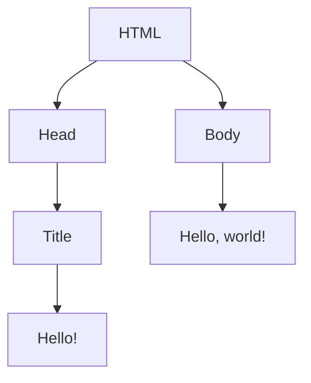

---
# try also 'default' to start simple
theme: default
# random image from a curated Unsplash collection by Anthony
# apply any windi css classes to the current slide
class: 'text-center'
# https://sli.dev/custom/highlighters.html
highlighter: shiki
# show line numbers in code blocks
lineNumbers: false
# some information about the slides, markdown enabled
info: |
  ## SSEC Presentation Slides
# persist drawings in exports and build
drawings:
  persist: false
# use UnoCSS (experimental)
css: unocss
download: true
---

# Web Programming

Sutomo 1 Science Exploration Club


---

# HTML

<div grid="~ cols-2 gap-8">
<div>

```html
<!DOCTYPE html> 
<html lang="en"> 
  <head> 
    <title>Hello!</title> 
  </head> 
  <body> 
    Hello, world! 
  </body> 
</html
```

</div>
<div>


</div>

</div>

<style>
h1 {
  font-size: 4rem;
}
pre{
  font-size: 1.5rem !important;
  line-height: 2.5rem !important;
  margin-top: 1rem;
}
</style>

---

# CSS

<div grid="~ cols-2 gap-8">
<div>

```css
.box {
  width: 100px;
  height: 100px;
  background-color: red;
}
.box:hover {
  background-color: blue;
}
```

</div>
<div>


</div>

</div>

<style>
h1 {
  font-size: 4rem;
}
pre{
  font-size: 1.5rem !important;
  line-height: 2.5rem !important;
  margin-top: 1rem;
}
</style>

---

# JavaScript

<div grid="~ cols-2 gap-8">
<div>

```js
const name = "SSEC";
console.log(`Hello, ${name}!`);

const myname = "Budi";
const myage = 20;
const myhobby = "Coding";
console.log(`My name is ${myname}, I am ${myage} years old, and I like ${myhobby}.`);
```

</div>
<div>


</div>

</div>

<style>
h1 {
  font-size: 4rem;
}
pre{
  font-size: 1.5rem !important;
  line-height: 2.5rem !important;
  margin-top: 1rem;
}
</style>

---
layout: center
class: text-center
---

# HTML

---

```html {all|1|2,9|3,5|4|6,8|7|all}
<!DOCTYPE html> 
<html lang="en"> 
  <head> 
    <title>Hello!</title> 
  </head> 
  <body> 
    Hello, world! 
  </body> 
</html
```

<style>

pre{
  font-size: 1.5rem !important;
  line-height: 2.5rem !important;
  margin-top: 1rem;
}
</style>
---

# Document Object Model


<div grid="~ cols-2 gap-8">
<div>

```html
<!DOCTYPE html> 
<html lang="en"> 
  <head> 
    <title>Hello!</title> 
  </head> 
  <body> 
    Hello, world! 
  </body> 
</html
```

</div>
<div>




</div>

</div>

<style>
h1 {
  font-size: 4rem;
}
pre{
  font-size: 1.5rem !important;
  line-height: 2.5rem !important;
  margin-top: 1rem;
}
</style>

---

# Common HTML Tags
- `<h1>` - `<h6>`: Heading
- `<p>`: Paragraph
- `<a>`: Anchor (link)
- ``: Image
- `<ul>`, `<ol>`: Unordered/Ordered List
- `<table>`: Table
- `<form>`, `<input>`: Forms, Inputs